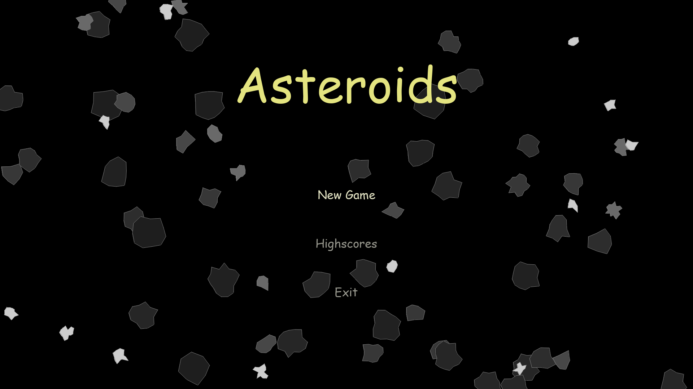

# Asteroids
> A simple encryptor/decryptor with usefull interface for anyone who wants to learn about the process.

## Screenshots

## Instructions
* rotation - A/D/left/right
* forward - W/up
* fire - spacebar

## TODO
* Option for users to change their name 
* simple AI for npc to fly the ship as a simulation in main menu's background